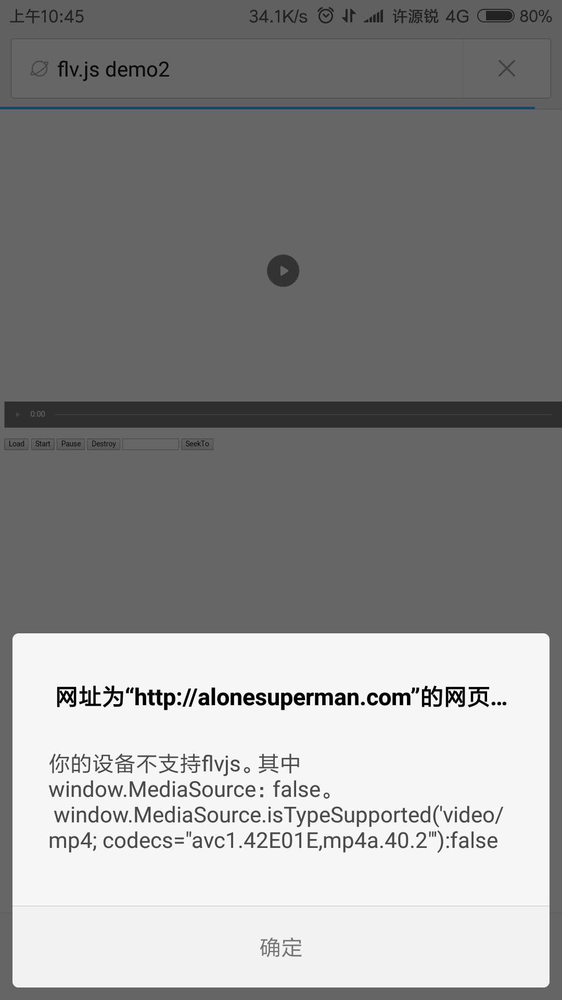

## 前言
&emsp;&emsp;目前常见的直播协议及其简单介绍如下：
+ RTMP: 底层基于TCP，在浏览器端依赖Flash。
+ HTTP-FLV: 基于HTTP流式IO传输FLV，依赖浏览器支持播放FLV。
+ WebSocket-FLV: 基于WebSocket传输FLV，依赖浏览器支持播放FLV。WebSocket建立在HTTP之上，建立WebSocket连接前还要先建立HTTP连接。
+ HLS: Http Live Streaming，苹果提出基于HTTP的流媒体传输协议。HTML5可以直接打开播放。
+ RTP: 基于UDP，延迟1秒，浏览器不支持。

&emsp;&emsp;常见直播协议延迟与性能数据（只做对比参考）如下：

| 传输协议      |     播放器 |   延迟   |    内存   |   CPU   |
| :-------- | --------:| :------: | :------:  |  :------: |
| RTMP    |   Flash |  1s  |  430M | 11% |
| HTTP-FLV  | Video | 1s  | 310M | 4.4% |
| HLS | Video | 20s | 205M | 3% |

在支持浏览器的协议里，延迟排序是：
&emsp;&emsp;RTMP = HTTP-FLV = WebSocket-FLV < HLS
而性能排序则恰好相反：
&emsp;&emsp;RTMP > HTTP-FLV = WebSocket-FLV > HLS
从这点上看的话， 延迟小的性能反而不好。

另外，通过以上比较，综合延迟以及性能，可见在浏览器上做直播的话，使用 HTTP-FLV 协议是不错的。

## 什么是`flv.js`？
&emsp;&emsp;`flv.js`是一个不借助于`Flash`却可以实现在浏览器上播放`HTML5 Flash流媒体视频(FLV)`的，由纯原生的JavaScript编写的`js插件`。
&emsp;&emsp;基本原理是通过将 FLV 文件流转码复用成 ISO BMFF（MP4 碎片）片段，然后通过 Media Source Extensions（API） 将 MP4 片段喂进浏览器。它是前`bilibili`的员工受到`hls.js`的启发而创作的一个开源项目，[github入口请点击这里](https://github.com/Bilibili/flv.js)！

&emsp;&emsp;本文将顺序介绍`flv.js`的功能、优点、缺点，并在最后给出一个使用`flv.js`的实例。

## `flv.js`的功能
&emsp;&emsp;目前各大浏览器厂商已经默认禁用 Flash，以前常见的Flash直播方案需要用户同意使用Flash后才可以正常使用直播功能，这样的用户体验很致命。
&emsp;&emsp;而`flv.js`则可以在不使用 Flash 的情况下播放FLV流视频。下面列出了它的几点功能：
+ 它是一个具有`H.264 + AAC`编码器播放功能的FLV 容器
+ 多部分分段视频播放
+ HTTP FLV 低延迟实时流播放
+ FLV 通过 WebSocket 实时流播放
+ 兼容 Chrome, FireFox, Safari 10, IE11 和 Edge
+ 开销很低，使用了浏览器的硬件加速

## `flv.js`的优点
+ HTML5 原生仅支持播放 mp4/webm 格式，flv.js 实现了在HTML5上播放FLV格式视频
+ 建立在采用了硬件加速的Video标签上，因此性能好，支持高清
+ 在 HTML5 上支持了延迟极低的 HTTP FLV 播放，解决了对`Flash`的依赖问题
+ 支持`录播`和`直播`

## `flv.js`的缺点
+ FLV里所包含的视频编码必须是H.264，音频编码必须是AAC或MP3， IE11和Edge浏览器不支持MP3音频编码，所以FLV里采用的编码最好是H.264+AAC。
+ 在录播上依赖于原生 HTML5 的Video标签和Media Source Extensions API。
+ 在直播上不仅依赖于原生 HTML5 的Video标签和Media Source Extensions  API，同时依赖 HTTP-FLV 或者 WebSocket 中的一种协议来传输FLV。其中 HTTP FLV 需通过流式IO去拉取数据，比如fetch或者stream。
+ flv.min.js 文件gzip压缩后与flash播放器gzip压缩后的大小相差无几。
+ 由于依赖Media Source Extensions  API，目前所有iOS和Android4.4.4以下里的浏览器都不支持，也就是说目前对于移动端flv.js基本是不能用的。

## 使用实例
&emsp;&emsp;使用`flv.js`的一个具体例子可以点击  [这里](http://alonesuperman.com/show/flv/demo/) !
&emsp;&emsp;在 Google Chrome	59.0.3071.115 (正式版本) （32 位）中的效果图如下：

&emsp;&emsp;而在 Android 6.0.1 的小米4手机的浏览器上是无法使用的。如下图：

&emsp;&emsp;另外，其在 iOS 上的 Safari 浏览器下也是无法使用的。

#### 综上，`flv.js`在移动端上的使用还是比较局限的。